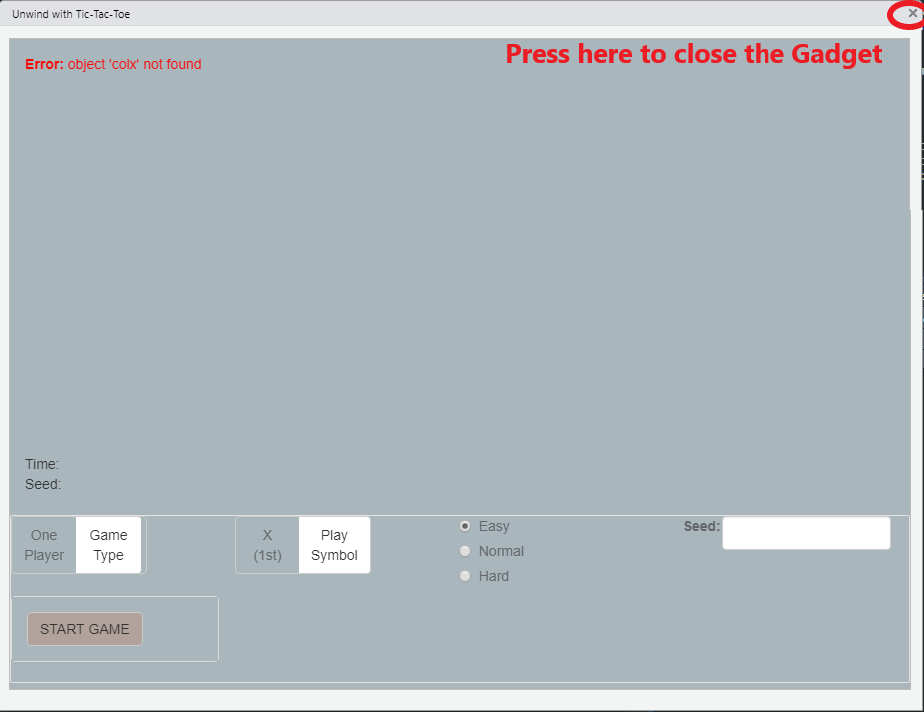
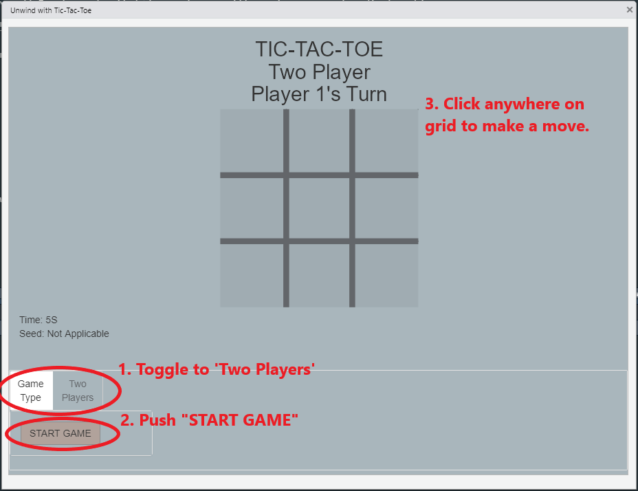
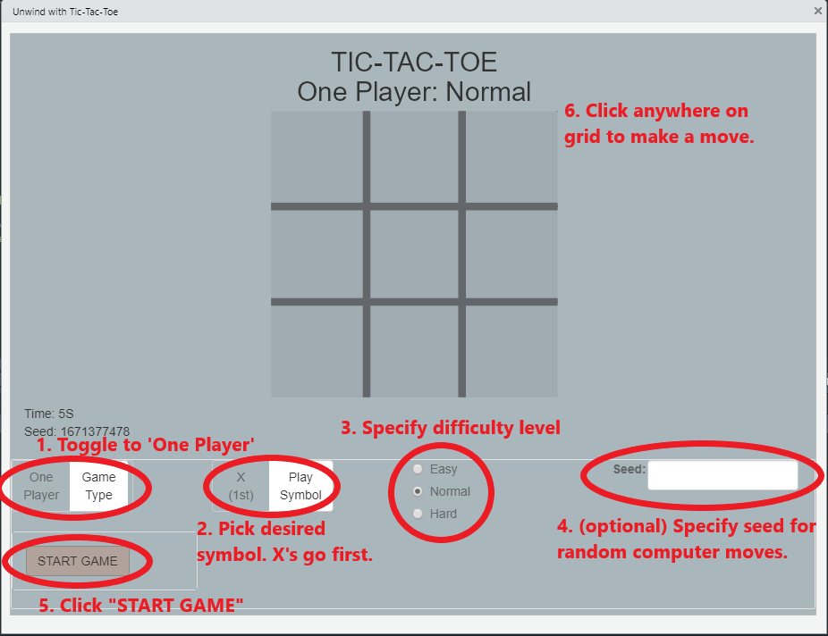
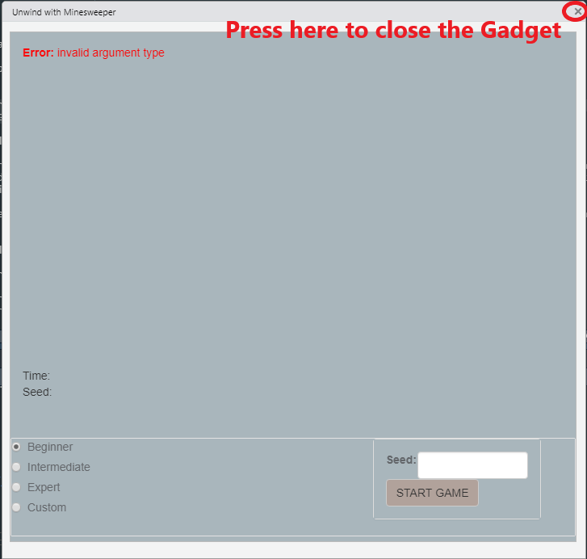
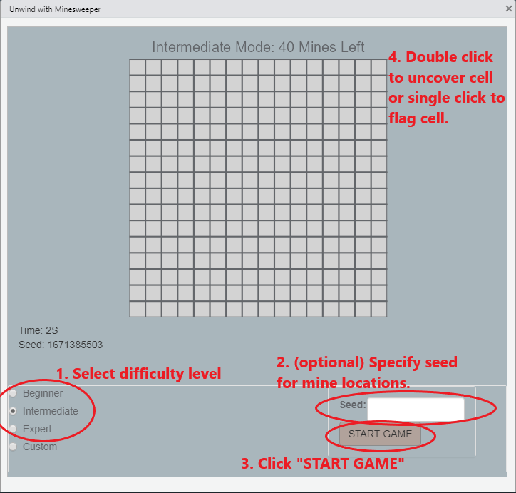
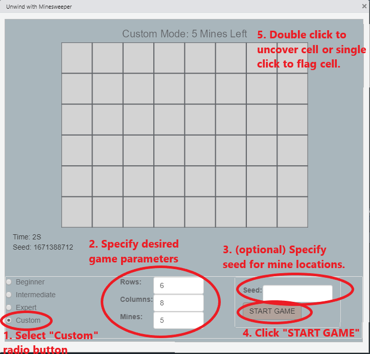

# Introduction and Motivation 

R is an extremely powerful visualization and analytics software which allows users to accomplish complex tasks in a systematic way. But R can be used for far more than completing analytical projects, it can be used to have fun!  

Playing games has many benefits including giving the brain a break from solving problems in-between tasks, improving problem-solving and logic skills, and general cognitive exercise. This package aims to provide an easily accessible platform of simple computer games that R programmers can use to enjoy these benefits.   
      

While there are other R packages which contain games programmed in R, such as the 'fun' package developed by Yihui Xie <https://cran.rstudio.com/web/packages/fun/fun.pdf>, the unwind package aims to create interactive games that can be played in shiny Gadgets rather than in the R console. Specifically, the aforementioned 'fun' package also includes a Minesweeper module is simple to use. However, to call the Minesweeper grid, the user must supply the following code rather than a simple function name:   

```{r, include = T, eval = F}
if (interactive()) {
     if (.Platform$OS.type == "windows")
         x11() else x11(type = "Xlib")
     mine_sweeper()
}
```

This is hard to remember and would likely require that the user pull up the help documentation every time they want to launch a Minesweeper game from the RStudio platform. Additionally, this version of Minesweeper does not allow for users to specify difficulty level nor does it allow them to double-click to uncover multiple cells at once like a standard Minesweeper game.  

The unwind package aims to improve upon the 'fun' package's version of Minesweeper by allowing custom grid options and the option to uncover all logically available cells with a double click. Unwind allows the R user to call a single function to play either Tic-Tac-Toe or Minesweeper directly from the RStudio platform. Through the use of Shiny Gadgets, a simple function call enables the user to interact directly with the game board and simply close the pop-up window when done playing. Included games have several customization options including difficulty levels, random seed specification for replaying boards, and the option to save game settings and statistics.  

# Utilizing Package Content

enter instructions for install here...     

## TIC-TAC-TOE   

Tic-Tac-Toe is a two-player game where players take turns placing "X"'s and "O"'s on a 3x3 game board. The goal of the game is to be the first player to get three of your chosen symbol in a line: either by row, column, or diagonal across the board.   

To launch the Tic-Tac-Toe user-interface, simply type 'tictactoe()' into the R console after following the package installation instructions in the 'Utilizing Package Content' section. Upon submitting this function, a shiny Gadget will appear:  

<center>{#id .class width=75%}</center>   

Several game options are detailed in bottom half of the pop-up window. Here a user is able to select which type of Tic-Tac-Toe game they would like to begin playing. The main choice for this module is whether the user would like to start a one-player (default) or two-player game of Tic-Tac-Toe. Further customization options and tutorials for one and two-player games are discussed in the following subsections.   

When a user has decided they are done playing games of Tic-Tac-Toe, they are able to close the pop-up window using the 'x' button in the top right-hand corner of the Gadget. 

<center>{#id .class width=75%}</center>   

Once the gadget has been closed, a message will appear in the user's console which reads:

*Your game log is saved as a dataframe in the global environment named 'gamelog_ttt'.  
To save your next game(s) to this log, supply the log object as the argument to the tictactoe function on startup.  
Come back to unwind soon!*   

In fact, if the user checks their global environment, they will see an object named 'gamelog_ttt' which details all completed games of Tic-Tac-Toe that were played in the prior session. The user can then save this object under a different name or write it to an external file.  

It is recommended to supply the game-log object as an argument to the start-up function the next time the user decides to play. For example, if the user did not re-name the game-log object and it still exists in the global environment, 'tictactoe(gamelog_ttt)' will start a new session of Tic-Tac-Toe in which new games will be appended to the existing game-log.  

Supplying a re-named game-log is also acceptable. For example, if the user desires to save the original game-log to a custom named object and then use it as the log for the next round of Tic-Tac-Toe, this is acceptable:  

```{r, include = T, eval = F}
custom_log_name <- gamelog_ttt
tictactoe(custom_log_name)
```

An example Tic-Tac-Toe game log is shown below.  

<center>{#id .class width=75%}</center>  

 Column meanings are as follows:   
 
 * StartTime: Date and time the game was initialized (ie. when the "START GAME" button was pressed)  
 * GameType: Description of game type, either 'Two Player' or 'One Player' with selected difficulty level appended   
 * RandSeed: For one player games, the random seed that controls the computer's moves, this can be user specified if desired. For two player games, 'Not Applicable'.  
 * GameResult: Outcome of the game. For one player games, 'Win', 'Loss', or 'Draw'. For two player games, indicates which player won or 'Draw'.  
 * GameTime: Time to game completion using StartTime as the reference start time  
 * NumMoves_X: Number of moves "X" player played  
 * NumMoves_O: Number of moves "O" player played  
 
If a user tries to supply a dataframe that does not have all 7 columns detailed above, the app will continue to run but display this message:  
  
*Warning: User-supplied game log does not contain all necessary columns.  
User-supplied game log will be ignored and a new game log will be started.*   

The user-supplied game-log will be ignored and no information from the supplied dataframe will appear in the log output upon closing the Gadget.  

Alternatively, if the user tries to supply a dataframe which has additional columns included, the app will continue to run but display this message:  

*Warning: User-supplied game log contains more columns than expected.
Additional columns will be removed from game log.*  

The returned game-log upon closing the Gadget will not contain the extra columns but will contain all rows in the original game-log supplied by the user in addition to any additional games played during the session.    

### Two Player Game  

To play a two-player game of Tic-Tac-Toe, first launch the shiny Gadget as described above. Then follow the steps below:   

1. Toggle the "Game Type" switch button to indicate "Two Players"  
2. Push "START GAME"    
3. Player 1 clicks anywhere on the grid that pops up to make their first move    
4. Player 2 clicks on any blank space on the grid to make their first move   
5. Players continue to place moves until either one player wins or the game ends in a draw  

<center>{#id .class width=75%}</center>  

Upon starting a new game, the timer shown in the bottom left corner will start to count up by seconds, indicating how long the game takes to complete. In addition, the seed value used for the computer's moves is also shown. This value is the truncated integer of the current system time.  

The grid always indicates which player is currently expected to make a play. When the game has completed, the playing grid will disappear, the timer shown in the bottom corner will say 'NA', and a dialog box will appear which details the outcome of the game. It will say one of the following messages:  

*Tic-Tac-Toe, three-in-a-row! Player 1 has won the game!*   

*Tic-Tac-Toe, three-in-a-row! Player 2 has won the game!*  

*The game has completed without a winner.*   

If a new two-player game is desired, click 'START GAME' again and follow the same process. However, if the user wants to play a one-player game, toggle the "Game Type" switch to "One Player" and follow the tutorial outlined in the following "One Player Game" section below.  

### One Player Game   

There are many more game initialization specifications for a one-player game of Tic-Tac-Toe. The basic steps to launch a new game are as follows:  

1. Toggle "Game Type" switch to "One Player"
2. Decide if you want to play first or second. Toggle the "Play Symbol" switch to reflect your choice noting that X's always go first.
  + If "O (2nd)" is selected, upon starting the game an 'X' will appear in the grid to reflect the computer's first move.
3. Select a difficulty level using the radio buttons which say "Easy", "Normal", or "Hard"
  + "Easy" will tell the computer to randomly choose a cell on the grid which is least likely to block the player's win or result in the computer's win.
  + "Normal" will tell the computer to choose a move completely at random.
  + "Hard" will have the computer prioritize winning the game, blocking the user's win, and picking the next best move in that order.
4. Specify a seed value if desired. This feature is most helpful for de-bugging, it is recommended to leave this field blank for most users.
5. Click "START GAME"
6. Begin playing by clicking on any free cell in the grid to make a move.
  + After every move made by the user, a computer move will also appear and the user can then continue to make the next desired move.  
  
<center>{#id .class width=75%}</center>  

Upon starting a new game, the timer shown in the bottom left corner will start to count up by seconds, indicating how long the game takes to complete. In addition, the seed value used for the computer's moves is also shown. This value is the truncated integer of the current system time.  

After every user-supplied move, the grid will update for both the user and the computer. The grid will continue to update until the game ends in a win for either the user or computer or a draw. When the game has completed, the playing grid will disappear, the timer shown in the bottom corner will say 'NA', and a dialog box will appear which details the outcome of the game. It will say one of the following messages:  

*Tic-Tac-Toe, three-in-a-row! You've won the game!*   

*Oh No! You've lost the game!*  

*The game has completed without a winner.*   

If a new two-player game is desired, modify the user inputs as desired as detailed in steps 2-4 above, click 'START GAME' and follow the same game-play process. However, if the user wants to play a two-player game, toggle the "Game Type" switch to "Two Players" and follow the tutorial outlined in the following "Two Player Game" section above.    

## Minesweeper   

Minesweeper is a popular logic puzzle which used to come pre-installed on Windows operating systems. The Minesweeper game board is a grid the size of which is determined by difficulty level, where a random selection of cells in the grid are predetermined to hold mines. The number of mines in a grid is also determined by difficulty level. The remaining cells are labeled with the number of mines surrounding it. The goal of the game is to uncover all cells which do not contain a mine. If the user uncovers a cell which contains a mine, the game is lost.   

To launch the Minesweeper user-interface, simply type 'minesweeper()' into the R console after following the package installation instructions in the 'Utilizing Package Content' section. Upon submitting this function, a shiny Gadget will appear:  

<center>{#id .class width=75%}</center>   

Game options are detailed in bottom half of the pop-up window. Here a user is able to select a difficulty level they would like to begin playing. The main choice for this module is whether the user would like to start a pre-determined difficulty or a custom difficulty option of minesweeper. Further customization options and tutorials for pre-determined and custom games are discussed in the following subsections.   

When a user has decided they are done playing games of Minesweeper, they are able to close the pop-up window using the 'x' button in the top right-hand corner of the Gadget. 

<center>{#id .class width=75%}</center>   

Once the gadget has been closed, a message will appear in the user's console which reads:

*Your game log is saved as a dataframe in the global environment named 'gamelog_mine'.  
To save your next game(s) to this log, supply the log object as the argument to the minesweeper function on startup.  
Come back to unwind soon!*   

In fact, if the user checks their global environment, they will see an object named 'gamelog_mine' which details all completed games of Minesweeper that were played in the prior session. The user can then save this object under a different name or write it to an external file.  

It is recommended to supply the game-log object as an argument to the start-up function the next time the user decides to play. For example, if the user did not re-name the game-log object and it still exists in the global environment, 'minesweeper(gamelog_mine)' will start a new session of Minesweeper in which new games will be appended to the existing game-log.  

Supplying a re-named game-log is also acceptable. For example, if the user desires to save the original game-log to a custom named object and then use it as the log for the next round of Minesweeper, this is acceptable:  

```{r, include = T, eval = F}
custom_log_name <- gamelog_mine
minesweeper(custom_log_name)
```

An example Minesweeper game log is shown below.  

<center>{#id .class width=75%}</center>  

 Column meanings are as follows:   
 
 * StartTime: Date and time the game was initialized (ie. when the "START GAME" button was pressed)  
 * DiffLev: Description of difficulty level, either "Beginner", "Intermediate", "Expert", or "Custom"  
 * NumRows: Number of rows in the playing grid (8 if Beginner Game, 16 if Intermediate or Expert Game, User supplied if Custom Game)  
 * NumCols: Number of columns in the playing grid (8 if Beginner Game, 16 if Intermediate Game, 30 if Expert Game, User supplied if Custom Game)   
 * NumMines: Number of mines in the playing grid (10 if Beginner Game, 40 if Intermediate Game, 99 if Expert Game, User supplied if Custom Game)   
 * RandSeed: Random seed that controls the layout of mines on the playing grid, this can be user specified if desired.    
 * GameResult: Outcome of the game. Either "Win" or "Loss".  
 * GameTime: Time to game completion using StartTime as the reference start time  
 
If a user tries to supply a dataframe that does not have all 8 columns detailed above, the app will continue to run but display this message:  
  
*Warning: User-supplied game log does not contain all necessary columns.  
User-supplied game log will be ignored and a new game log will be started.*   

The user-supplied game-log will be ignored and no information from the supplied dataframe will appear in the log output upon closing the Gadget.  

Alternatively, if the user tries to supply a dataframe which has additional columns included, the app will continue to run but display this message:  

*Warning: User-supplied game log contains more columns than expected.
Additional columns will be removed from game log.*  

The returned game-log upon closing the Gadget will not contain the extra columns but will contain all rows in the original game-log supplied by the user in addition to any additional games played during the session.    

### Built-in Difficulty Levels  

To play a standard difficulty level, first launch the shiny Gadget as described above. Then follow the steps below:   

1. Change radio button to desired standard difficulty level:  
  * Beginner: Gives a 8 x 8 grid with 10 mines  
  * Intermediate: Gives a 16 x 16 grid with 40 mines  
  * Expert: Gives a 16 x 30 grid with 99 mines  
2. Specify a seed value if desired. This feature is most helpful for de-bugging, it is recommended to leave this field blank for most users.  
3. Push "START GAME" and wait for playing grid to appear      
4. Double click on any cell in the grid to uncover the cell  
5. Click on any cell in the grid to flag the cell  
6. Continue to uncover and flag cells until all cells except mines are uncovered (win) or a mine is inadvertently uncovered (loss)    

<center>{#id .class width=75%}</center>  

Upon starting a new game, the timer shown in the bottom left corner will start to count up by seconds, indicating how long the game takes to complete. In addition, the seed value used for the determining the location of mines is also shown. This value is the truncated integer of the current system time.  

The grid always indicates which difficulty level was specified upon game initiation and how many remaining mines (ie. have not been flagged) in the playing grid. When the game has completed, the playing grid will disappear, the timer shown in the bottom corner will say 'NA', and a dialog box will appear which details the outcome of the game. It will say one of the following messages:  

*Congratulations! You've won the game!*   

*Oh No! You've uncovered a mine!*  

If a new standard difficulty game is desired, click new difficulty level ("Beginner", "Intermediate", "Expert") using the radio buttons and then click "START GAME" again and follow the same process. However, if the user wants to play a custom-grid game, click the "Custom" option radio button and follow the tutorial outlined in the following "Custom Difficulty Level" section below.  

### Custom Difficulty Level

To play a custom difficulty level, first launch the shiny Gadget as described above. Then follow the steps below:   

1. Change radio button to "Custom".  
2. Specify desired game parameters:  
  * Rows input box will take a numeric value from 1 to 30  
  * Columns input box will take a numeric value from 1 to 50  
  * Mines input box will take a numeric value from 1 to 499 (Note: it is recommended that the maximum number of mines for any grid should be less than or equal to (number of rows - 1) *(number of columns - 1))  
2. Specify a seed value if desired. This feature is most helpful for de-bugging, it is recommended to leave this field blank for most users.  
3. Push "START GAME" and wait for playing grid to appear      
4. Double click on any cell in the grid to uncover the cell  
5. Click on any cell in the grid to flag the cell  
6. Continue to uncover and flag cells until all cells except mines are uncovered (win) or a mine is inadvertently uncovered (loss)    

<center>{#id .class width=75%}</center>  

Upon starting a new game, the timer shown in the bottom left corner will start to count up by seconds, indicating how long the game takes to complete. In addition, the seed value used for the determining the location of mines is also shown. This value is the truncated integer of the current system time.  

The grid always indicates "Custom Mode" upon game initiation and also indicates how many remaining mines (ie. have not been flagged) in the playing grid. When the game has completed, the playing grid will disappear, the timer shown in the bottom corner will say 'NA', and a dialog box will appear which details the outcome of the game. It will say one of the following messages:  

*Congratulations! You've won the game!*   

*Oh No! You've uncovered a mine!*  

If a new standard custom game is desired, alter the game parameters in steps 2-3 above and then click "START GAME" and follow the same process. However, if the user wants to play a standard difficulty game, click one of the standard difficulty radio buttons ('Beginner', 'Intermediate', 'Expert') and follow the tutorial outlined in the "Built-in Difficulty Levels" section above.  

# Future Work  

Future work on the unwind package may the following:  

* In both Minesweeper and Tic-Tac-Toe modules, the playing grid disappears when the outcome of the game has been determined. This can be slightly jarring for the user, especially in Tic-Tac-Toe where the user may not have seen the winning move before it is played. Future plans would allow the grid to be visible after the game has completed but not allow the user to continue to make moves on the game board. This would be accomplished with a dynamic binary logical object which determines whether the game has been completed, and therefore, whether a move can be made.  

* In both Minesweeper and Tic-Tac-Toe modules, the user input for the seed value is a textInput shiny object. This is not optimal since a seed value needs to be numeric to be valid. However, simply changing the input to a numericInput shiny objects requires that the developer specify a default value. In the unwind package, we want to use the system time (as.numeric(Sys.time())) for the default seed value every time the 'START GAME' button is pressed. This is not entirely straightforward since the default numericInput value is only specified once. Some research and use-case testing needs to be done to address this potential bug.  

* The Minesweeper module of the unwind package has a tendency to run slowly. Start-up of the game board is particularly slow which could lead the user to thinking that the game is not loading. A temporary quick-fix could be to display a message while the board creation is ongoing. However, ideally optimization options to creating the game board could be explored. The current code loops through every cell in the grid before the game starts to pre-determine all of the true cell values. One alternative is to only determine a cell's value when the user clicks on that cell. This would save some time up front but might make the user's solve time a little longer. Some efficiency testing is needed to determine an ideal solution.   

* Finally, the unwind package's goal is to create modules which allow R programmers to take a brain break in between tasks. Thus, additional shiny Gadget games could be explored for further package development. Games such as wordsearch, crossword puzzles, and sudoku could be candidates for future game developments.   
